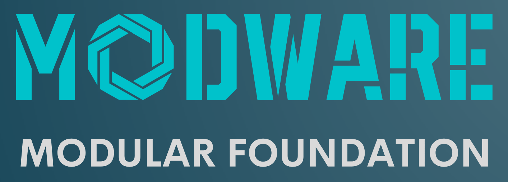
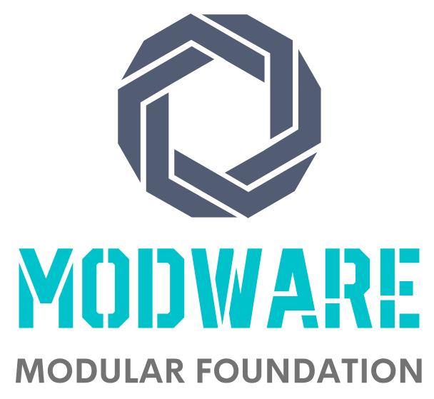
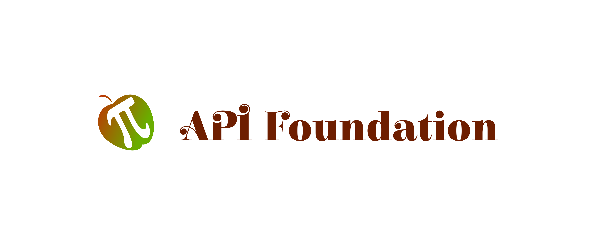
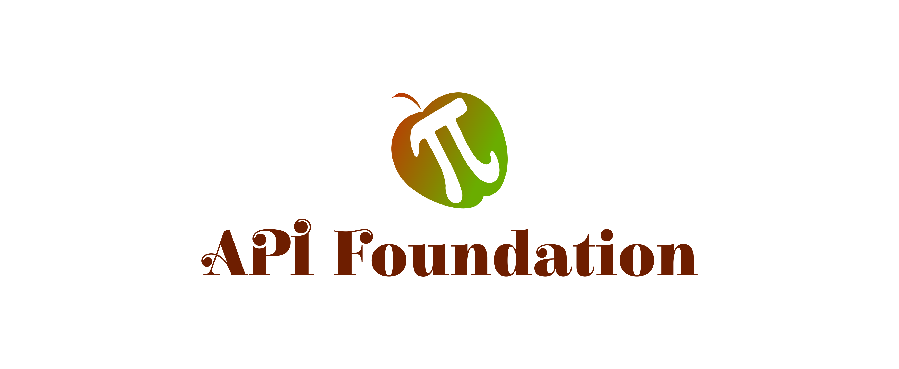
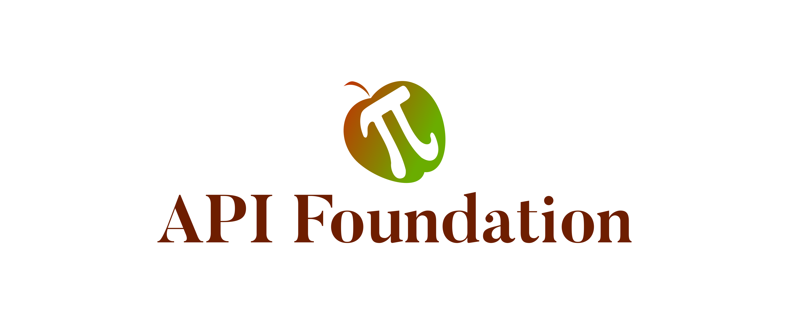
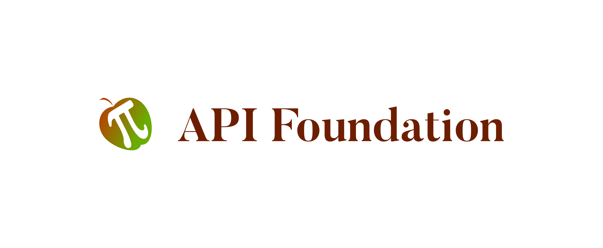
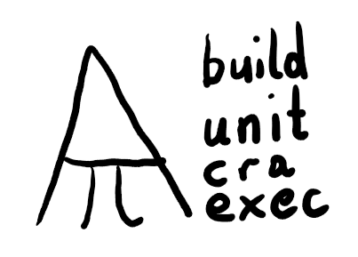
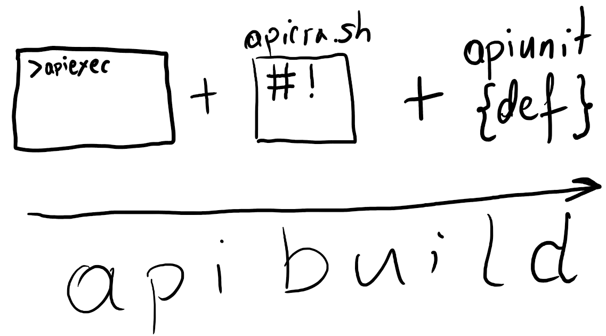

## ApiFoundation logo

+ [Modular Foundation - Opensource and Free Environment](https://www.modware.org/)
+ [docs - Information about MODWARE Foundation](https://docs.modware.org/)


## 11 rectangle



<div style="background: rgb(217, 217, 217);"><span style="color: rgb(255, 255, 255);">#D9D9D9</span></div><div style="background: rgb(0, 194, 203);"><span style="color: rgb(255, 255, 255);">#00C2CB</span></div><div style="background: rgb(18, 66, 85);"><span style="color: rgb(255, 255, 255);">#124255</span></div><div style="background: rgb(242, 242, 242);"><span style="color: rgb(17, 17, 17);">#f2f2f2</span></div><div style="background: rgb(191, 191, 191);"><span style="color: rgb(255, 255, 255);">#bfbfbf</span></div><div style="background: rgb(0, 243, 254);"><span style="color: rgb(255, 255, 255);">#00f3fe</span></div>


## 12 Square


<div style="background: rgb(82, 92, 114);"><span style="color: rgb(255, 255, 255);">#525c72</span></div><div style="background: rgb(115, 115, 115);"><span style="color: rgb(255, 255, 255);">#737373</span></div><div style="background: rgb(0, 194, 203);"><span style="color: rgb(255, 255, 255);">#00C2CB</span></div><div style="background: rgb(255, 255, 255);"><span style="color: rgb(17, 17, 17);">#FFFFFF</span></div><div style="background: rgb(103, 116, 144);"><span style="color: rgb(255, 255, 255);">#677490</span></div><div style="background: rgb(61, 68, 84);"><span style="color: rgb(255, 255, 255);">#3d4454</span></div>


## Colors
text
+ brown #6E1E00

icon
+ red #C13104
+ green #6AAD00

## Font
Font in use ElsieSwashCaps-Black designed by Alejandro Inler and licensed under Open Font License. Icon Designed by Mark S Waterhouse
https://fonts.google.com/specimen/Elsie+Swash+Caps

## 1


## 2


## Logo API


## 3


## 4


## Font

Font in use Butler_Bold designed by Fabian De Smet and licensed under Creative Commons by 4.0. Icon Designed by Mark S Waterhouse
http://fabiandesmet.com/portfolio/butler-font/
 
 
## Another fotos







---
+ [edit](https://github.com/api-foundation/logo/edit/master/README.md)

```
https://github.com/api-foundation/logo.git
```
